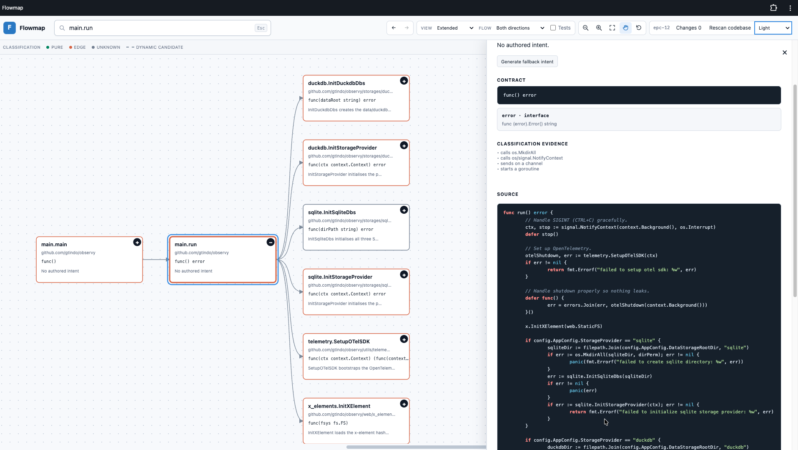
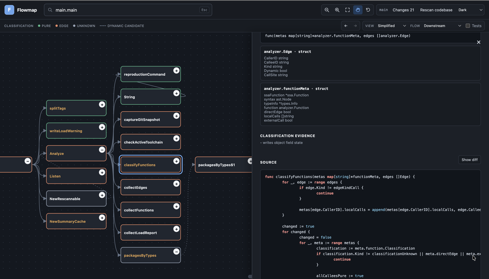

<div class="guide-hero">
  
  <h1>Flowmap User Guide</h1>
  <p>Explore, navigate, and audit Go repositories through a focused, function-level call graph.</p>
  <div class="hero-actions">
    <a class="button button-primary" href="https://github.com/gtindo/flowmap/releases/latest">Download Flowmap</a>
    <a class="button" href="https://github.com/gtindo/flowmap">View on GitHub</a>
  </div>
</div>

Flowmap is a local, read-only spatial workbench for understanding Go repositories. Instead of presenting code only as files in a directory tree, it reveals the system as a **directed graph of functions and methods**.

> Flowmap performs static analysis. A call edge means a function *may* call another function; a dependency edge means a local function is passed as an argument or returned as a value. It maps potential relationships, not live runtime traces.

<div class="screenshots">
  <figure>
    
    <figcaption>Focused function exploration in the light theme</figcaption>
  </figure>
  <figure>
    
    <figcaption>The same spatial workbench in the dark theme</figcaption>
  </figure>
</div>

The online version of this guide is available at <https://gtindo.github.io/flowmap/>.

## Core Design Philosophy

Flowmap is built to address the cognitive blind spots of agentic workflows. When an AI agent adds large amounts of modular code across a project, reviewing it line by line through file tabs can be slow and disorienting.

### Spatial Code Review over File Trees

Computers execute software through calls, yet traditional IDEs present it through folder hierarchies. Flowmap exposes the structural skeleton of your logic so you can follow an execution path visually and reduce tab switching.

### Auditing Code Flux

Flowmap is an audit station for engineers who understand a project's domain but did not write every incoming line. It keeps compiler-derived information, including function signatures, parameters, and return types, prominent so you can assess structural validity and API contracts at a glance.

### Focused One-Hop Exploration

Most graph visualizers generate an unreadable view of an entire repository. Flowmap starts with a single hop from a chosen function. You decide what to reveal by expanding (`+`) or collapsing (`−`) individual branches.

## Get Flowmap

[Download the latest Flowmap version](https://github.com/gtindo/flowmap/releases/latest).

## Requirements

- macOS on Apple Silicon or Intel, or Linux on AMD64.
- Go 1.24, 1.25, or 1.26 available through `go` on your `PATH`. Flowmap uses that active toolchain to load and type-check the target module.
- Access to the target module's dependencies. Cached dependencies work offline; otherwise the Go toolchain may need network access.
- A modern web browser.

Flowmap reads the target working tree and stores optional graph layouts outside it. It does not edit the analyzed project.

## Install Flowmap

Choose the archive that matches your machine:

| Machine | Archive pattern |
| --- | --- |
| Linux AMD64 | `flowmap_<version>_linux_amd64.tar.gz` |
| Apple Silicon | `flowmap_<version>_darwin_arm64.tar.gz` |
| Intel Mac | `flowmap_<version>_darwin_amd64.tar.gz` |

Verify the downloaded archive from its directory:

```sh
shasum -a 256 -c SHA256SUMS
```

Extract it and optionally place the binary on your `PATH`:

```sh
tar -xzf flowmap_<version>_darwin_arm64.tar.gz
cd flowmap_<version>_darwin_arm64
./flowmap version
```

The download is not Apple-notarized. If macOS reports that it cannot verify the binary, inspect the artifact first. When you trust it, remove its quarantine attribute:

```sh
xattr -d com.apple.quarantine ./flowmap
```

## Start Flowmap

Pass the directory containing the target module's `go.mod` file:

```sh
./flowmap serve /path/to/go/project
```

Flowmap indexes the module, prints the number of discovered functions, and listens on `http://127.0.0.1:7878`. Open that address in a browser.

Useful options:

```sh
./flowmap serve /path/to/project --addr 127.0.0.1:9000
./flowmap serve /path/to/project --tags integration,linux
```

The server binds to localhost by default and is not exposed to other machines. Stop it with `Ctrl-C`.

## Add Flowmap to the macOS Dock

While Flowmap is running, open `http://127.0.0.1:7878` in your browser:

- In Safari, choose **File > Add to Dock**, keep the name **Flowmap**, and select **Add**.
- In Chrome or another Chromium browser, select the install icon in the address bar or choose **Install Flowmap** from the browser menu.

The installed app opens in its own window and can be launched from the Dock, Launchpad, or Spotlight. Flowmap still needs its local server, so run `flowmap serve` before opening the installed app. When the server is unavailable, the app shows a reminder rather than a connection-error page.

The installed app is tied to the exact address used during installation. When you change `--addr`, including its port, remove the existing web app and install it again from the new address.

## Start a Graph

1. Type part of a package, receiver, or function name in the search field.
2. Select a result. That function becomes the graph root.
3. Choose **Downstream** for callees, **Upstream** for callers, or **Both** for both directions.
4. Enable **Tests** to include test functions in search and graph results.

A new graph loads only one hop to preserve readability. In narrower windows, controls move to a second toolbar row so every action remains available.

Anonymous functions appear as graph nodes when they are called or passed by a visible function. You can inspect, expand, and focus them like other nodes, but they are omitted from search and Git change lists.

## Choose a Color Theme

Flowmap follows the operating system's light or dark appearance by default. Use the theme selector in the header to choose **System**, **Light**, or **Dark**. A manual choice is saved in browser storage; **System** continues to react to operating-system appearance changes.

## Rescan After Editing Code

Select **Rescan codebase** in the header after changing the target module. Flowmap rebuilds its analysis without stopping the server.

When the current root still exists, the graph refreshes with the same direction, test, and view settings. Transient node expansions and open details are cleared. If the root was removed, Flowmap returns to search.

Flowmap continues serving the last successful scan while the new analysis is built. If rescanning fails because the source cannot be analyzed, the previous graph remains available and the browser reports the error.

### Review Local Changes

When the module is inside a Git repository, each successful scan records the current branch and local function changes. The branch label and change list therefore describe the code shown by Flowmap; switch branches or edit files, then rescan to update them. Detached checkouts display an abbreviated commit instead of a branch name.

Select **Changes** in the header to review functions that differ from `HEAD`. This includes staged changes, unstaged changes, and functions in non-ignored untracked Go files. The list follows the **Tests** toggle and is sorted by qualified function name.

Graph node titles show the same status:

- Blue indicates a new function.
- Yellow or amber indicates an updated function.

Selecting a change focuses its graph and opens its details. Deleted functions are not listed because they are absent from the current scan.

## Navigate and Expand

- Select a node to open its detail panel.
- Choose **Focus graph here** to make that function the new root.
- Use the header's **Back** and **Forward** controls to revisit functions opened from search results or the detail panel. Navigation keeps direction, test visibility, and view mode while resetting transient expansions and viewport state.
- Select a node's `+` control to expand that function by one hop.
- After expansion, the control becomes `−`. Selecting it removes that expansion and descendant expansions that are no longer reachable. Nodes supplied by another expanded path remain visible.

Node-level expansion is particularly useful for large parser, router, or orchestration functions where a global depth increase would reveal too much at once.

## Graph Views and Layouts

**Extended** nodes show the qualified function name, package, signature, and intent. **Simplified** nodes show only the function name and are useful for larger structural maps.

Nodes are draggable in both views. Layouts are saved in browser storage and kept separately for each view, root function, direction, and test setting. **Reset layout** clears the saved positions for the current graph.

## Zoom and Pan

- Graphs open at 100% scale. Use the horizontal and vertical scrollbars, a trackpad, or Shift+wheel to navigate an oversized graph.
- Use `+` and `−` in the header to zoom the viewport.
- Use **Fit** to show the complete current graph.
- Enable **Hand** to drag the scrollable canvas viewport. The canvas includes one viewport of extra space beyond every edge, letting you pan nodes clear of the detail panel.
- Disable **Hand** to resume dragging individual nodes.

The small `+` or `−` attached to a function node controls graph expansion. The header buttons control zoom.

## Read a Node

The detail panel contains:

- Function signature and source location.
- Named structs and interfaces crossing the function boundary.
- The first paragraph of the source doc comment as authored intent.
- Functional classification and its evidence.
- The exact function source excerpt.
- For a locally changed function, a new or updated badge and a **Show diff** control beside the **Source** heading. It swaps the source viewer for the function-scoped unified diff; select **Show source** to switch back.

### Classification

A function is classified as one of the following:

- **pure:** Explicitly documented as pure, or conservatively inferred to have no visible effects and only pure local callees.
- **edge:** Explicitly documented as an imperative edge, or inferred from visible I/O, state mutation, time or random access, goroutines, or channels.
- **unknown:** Purity could not be established safely.

Authored classifications take precedence. Inferred classifications show their evidence and should be treated as navigation help rather than formal proof.

Solid edges represent statically resolved calls. Dashed edges represent possible interface or dynamic-dispatch targets. Dotted edges represent local functions passed as arguments, such as HTTP handler registration; these dependencies do not imply that the registering function invokes the callback.

## Troubleshooting

### No packages or functions are found

- Confirm the supplied path contains `go.mod`.
- Run the reproduction command printed by Flowmap and resolve its reported errors.
- Confirm that a supported Go version is installed.

### The active Go toolchain is newer than Flowmap supports

The `go` executable on your `PATH` determines the compiled export-data version that Flowmap must read. This differs from the `go` directive in the target module's `go.mod`: for example, Go 1.26 can produce Go 1.26 export data while loading a module whose directive says `go 1.24`.

This version supports active Go toolchains from Go 1.24 through Go 1.26. If `go env GOVERSION` reports Go 1.27 or newer, install a compatible Flowmap version. Go 1.23 and older are not supported.

Flowmap handles individual broken packages when healthy neighboring packages can still be loaded. It prints a warning with deduplicated `go list`, syntax, and type diagnostics for omitted package variants. If every package is broken, indexing stops and prints the same diagnostic report. Flowmap shows up to ten unique errors and reports how many additional errors were omitted.

### Dependencies cannot be loaded

Run the project's normal dependency command, commonly:

```sh
go mod download
```

Then start Flowmap again. Private dependencies require the same Git credentials and `GOPRIVATE` configuration that the Go toolchain uses.

### A call edge is absent or ambiguous

Static call graphs are conservative approximations. Reflection, generated code, build tags, and interface dispatch can reduce precision. Supply the appropriate `--tags` values and inspect dashed dynamic edges.

### A layout looks stale

Use **Reset layout**. Layouts are keyed by graph context, but major source changes can still make an old arrangement less useful.

### The port is already in use

Choose another loopback address:

```sh
./flowmap serve /path/to/project --addr 127.0.0.1:9000
```
